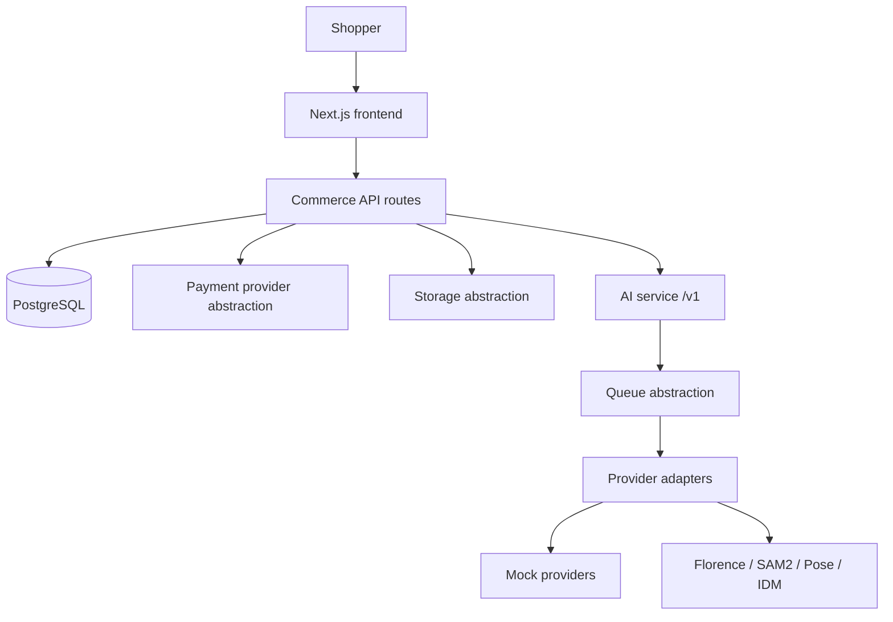

# LAHI architecture

LAHI is a complete consumer fashion e-commerce site. The AI virtual try-on system is a backend technology layer that lets a shopper see themselves in a selected garment before purchase.



## Authoritative systems

| Concern | Location |
| --- | --- |
| Customer UI and commerce/API | `frontend/` |
| Database | PostgreSQL + `frontend/prisma` |
| AI jobs and inference | `ai/` over stable `/v1` HTTP |
| Future service split | `backend/` scaffold only |

The commerce application must not import Florence, SAM2, IDM-VTON, GPU details, local model paths, or Colab notebook URLs.

## Commerce MVP

Implemented workflows:

- Users, sessions, profiles, addresses, roles
- Catalog: categories, brands, products, images, variants, sizes, colors, pricing
- Cart, wishlist, inventory reservation
- Checkout → pending order → payment intent → webhook → confirmed order
- Mock payments: success, failure, cancel, duplicate webhook, delayed webhook
- Cancellation, returns, refund records
- Reviews/ratings, coupons, shipping/tax, in-app notifications
- Admin area with server-side `ADMIN` checks

Order and payment writes that change money or stock run in database transactions.

Inventory model:

- `quantity` = on-hand units
- `reserved` = held for unpaid/open orders
- available = quantity − reserved
- payment success decrements both reserved and on-hand
- cancel before payment releases reservation
- cancel/refund after payment restores on-hand

## Payments

`frontend/lib/payments` is provider-agnostic. Development uses `PAYMENT_PROVIDER=mock`. Razorpay/Stripe are named extension points and are not wired. Browser redirect is not treated as payment proof; `/api/payments/webhook` is.

## Storage

`frontend/lib/storage` and `ai/runtime/storage.py` store bytes behind logical keys / asset IDs. Local disk is the development driver. S3, R2, and MinIO are reserved driver names and are not configured.

## AI job lifecycle

```
Create job → queued → processing → completed | failed | cancelled
```

Jobs record request id, operation, assets, provider/version, status, progress, timestamps, errors, and duration. Commerce stores a parallel `TryOnJob` row for the customer.

Execution mode:

- `AI_EXECUTION_MODE=mock` (default for local tests)
- `AI_EXECUTION_MODE=gpu` selects real adapters when weights exist

Queue:

- `AI_QUEUE_BACKEND=inline` for deterministic local tests
- `AI_QUEUE_BACKEND=thread` for a local server
- Redis can replace the queue later without changing job handlers

Google Colab is one GPU worker. The AI service only needs `AI_SERVER_TOKEN`, allowed origins, storage, and execution mode.

## Human representation

Available today: front/left/right/back canonical images, source video, optional pose JSON and segmentation when a provider returns them.

Planned / unavailable: DensePose, 3D mesh reconstruction, body measurements, identity embeddings. Those columns exist so later work does not require another conceptual model.

## Model manager

Heavy models are lazy. The manager reports name, provider, version, status, device, precision, capabilities, and a planning VRAM budget for sequential execution on a ~15 GB Tesla T4. Florence + SAM2 + IDM-VTON are not assumed to stay resident together.

## Production migration path

1. Keep Next.js as the commerce boundary until scale requires extraction.
2. Switch `STORAGE_DRIVER` to object storage.
3. Switch `PAYMENT_PROVIDER` to a live provider and verify webhooks.
4. Replace the in-process queue with Redis or equivalent.
5. Point `AI_SERVER_URL` at a dedicated GPU host. Do not special-case Colab.
